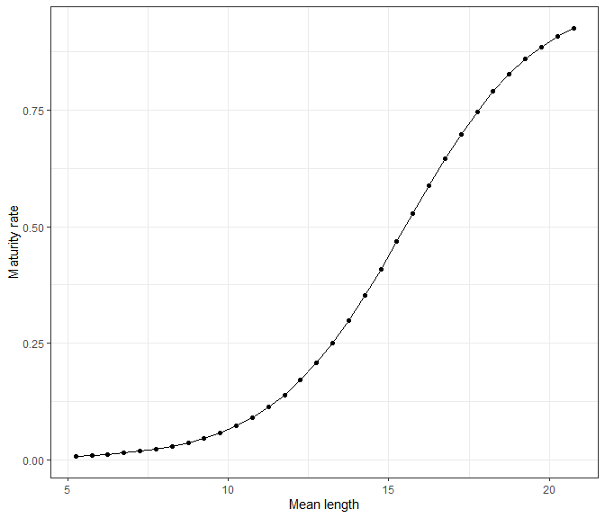
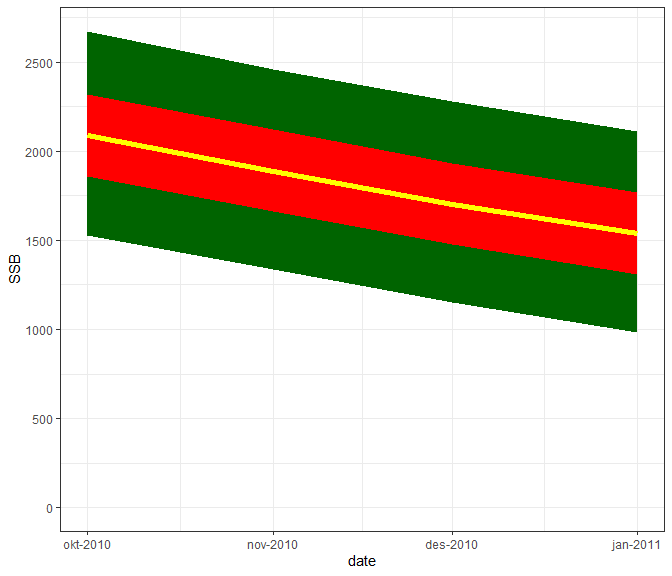

<!-- README.md is generated from README.Rmd. Please edit that file -->

# Bifrost package

Sondre Hølleland, Mahmood Jokar, Samuel Subbey <!-- badges: start -->
<!-- badges: end -->

*Institute of Marine Research, Norway.*

*Correspondance to: <sondre.hoelleland@hi.no>, <samuel.subbey@hi.no>*

## Capelin assessment

This R package is a wrapper for doing capelin stock assessment.


Capelin from the Barent Sea. Source: hi.no, Photographer: Jan de Lange /
Institute of Marine Research

## Plan of development

-   [x] Maturity
-   [x] Bifrost
-   [x] Monte Carlo Simulation

## TO-DO list

-   [ ] Make some diagnostic tools
-   [ ] Make the estimation more object oriented. Meaning: Create a
    class called “maturity”, with standard functions for evaluating the
    results.

## Install package

To install the package, run the following code:

``` r
library(devtools)
install_github("holleland/bifrost")
```

The package uses **TMB** (Template model builder).

## Maturity

Here is an example to play with if you want to estimate maturity for
capelin. In the package we have included a three datasets to help you
get started with running the maturity estimation. First of all, you need
to load the data:

``` r
library(bifrost)
#> 
#> ------------------------------------------------------------------------------
#> * Bifrost developers: Sondre Holleland and Samuel Subbey and others
#> ------------------------------------------------------------------------------
# -- load the data --
data(cap) # capelin abundance table
data(catch) # capelin catch data
data(maturityInitialParameters) # initial parameters for 1972-2019
head(cap)
#>   length.group     1 2 3 4 5 sum(10e9) biomass(10e3t) meanweight(g)
#> 1            1  0.00 0 0 0 0      0.00            0.0           0.0
#> 2            2  0.00 0 0 0 0      0.00            0.0           0.0
#> 3            3  2.63 0 0 0 0      2.63            1.8           0.7
#> 4            4  5.12 0 0 0 0      5.12            5.1           1.0
#> 5            5 11.89 0 0 0 0     11.89           14.3           1.2
#> 6            6 26.62 0 0 0 0     26.62           45.3           1.7
#>   meanlength(cm) year
#> 1           5.25 1972
#> 2           5.75 1972
#> 3           6.25 1972
#> 4           6.75 1972
#> 5           7.25 1972
#> 6           7.75 1972
head(catch)
#>   age year   winter05   winter03   winter02   spring01 spring05   spring04
#> 1   1 1972 0.00040000 0.00024000 0.00016000 0.00000000 0.000000 0.00000000
#> 2   2 1972 0.22621739 0.13573043 0.09048696 0.00520000 0.026000 0.02080000
#> 3   3 1972 0.16786677 0.10072006 0.06714671 0.25672112 1.283606 1.02688449
#> 4   4 1972 0.03472727 0.02083636 0.01389091 0.02366479 0.118324 0.09465918
#> 5   5 1972 0.00615000 0.00369000 0.00246000 0.00000000 0.000000 0.00000000
#> 6   1 1973 0.00000000 0.00000000 0.00000000 0.00000000 0.000000 0.00000000
#>   fill0 fill1 fill2 fill3 autumn08 autumn02
#> 1     0     0     0     0  0.00000  0.00000
#> 2     0     0     0     0  1.02296  0.25574
#> 3     0     0     0     0  7.41944  1.85486
#> 4     0     0     0     0  3.31168  0.82792
#> 5     0     0     0     0  0.25320  0.06330
#> 6     0     0     0     0  0.01000  0.00250
head(maturityInitialParameters)
#>   year agegr  p1   p2   p3 nu unknown
#> 1 1972   2-3 0.3 14.0 0.02 10       0
#> 2 1973   2-3 0.6 13.5 0.05 10       0
#> 3 1974   2-3 0.4 12.5 0.02  2       0
#> 4 1975   2-3 0.5 12.5 0.02  1       0
#> 5 1976   2-3 0.3 15.0 0.02  6       0
#> 6 1977   2-3 0.6 13.0 0.02  2       0
```

Having the data loaded, we can set up the estimation procedure for the
year 2003:

``` r
year <- 2010
#.. Create data list: ..
data.list <- createMaturityData(cap,
                                catch,
                                min_age = 2,
                                max_age = 3,
                                start_year =1972,
                                end_year = 2010)
# ..set up parameter list..
par.list <- createMaturityParameters(parameter = maturityInitialParameters,
                                    year = data.list$start_year, agegr = "2-3")
mFit <- estimateMaturity(data = data.list, parameters = par.list, silent =TRUE)
#.. Print estimates.. 
summary(mFit)
#>       Estimate Std. Error Test score     p-value*
#> p1  0.12113703 0.24116533  0.5022987 6.154574e-01
#> p2 15.51104442 3.71937363  4.1703378 3.041485e-05
#> p3  0.06633732 0.06692475  0.9912225 3.215770e-01
#> nu  2.33799694 0.50282071  4.6497626 3.323173e-06
#> 
#> * Using Gaussian approximation for p-values.
#> 
#> ------------------------------------------- 
#> Convergence code:              0 
#> Covergence message:            relative convergence (4) 
#> Negative loglikelihood value:  148.5777 
#> Akaike Information Criteria:   305.1553 
#> -------------------------------------------
```



You can also run all years sequentially using the following function:

``` r
result <- runMaturityYearByYear(cap = cap, catch = catch, initPar = maturityInitialParameters,
                                min_age = 3, max_age = 4, plot = TRUE)
```


``` r
result$plot
#> NULL
plot(result)
```


## Estimate consumption

``` r
data("consumptionData")
par.list <- list(
   logCmax   = log(1.2),
   logChalf  = log(1e2),
   logalpha  = log(2),
   logbeta   = log(2),
   logSigma  = log(1e3)
 )
 cFit <- estimateConsumption(data = consumptionData, parameters = par.list, silent =TRUE,
                             map  = list(logalpha = factor(NA),
                                         logbeta = factor(NA)))
 cFit
#> -- CONSUMPTION MODEL: -- 
#> Convergence?  0 :  relative convergence (4) 
#> ------------- 
#> Estimates? 
#>           Estimate   Std. Error   z value   Pr(>|z^2|)
#> Cmax   0.001793888 4.488696e-04 3.9964573 6.429748e-05
#> Chalf 67.352699998 1.263115e+02 0.5332269 5.938765e-01
#> alpha  2.000000000 0.000000e+00       Inf 0.000000e+00
#> beta   2.000000000 0.000000e+00       Inf 0.000000e+00
#> sigma  0.140482431 1.911724e-02 7.3484699 2.004886e-13
#> -------------
 summary(cFit)
#>           Estimate   Std. Error    Zscore     p-value*
#> Cmax   0.001793888 4.488696e-04 3.9964573 6.429748e-05
#> Chalf 67.352699998 1.263115e+02 0.5332269 5.938765e-01
#> alpha  2.000000000 0.000000e+00       Inf 0.000000e+00
#> beta   2.000000000 0.000000e+00       Inf 0.000000e+00
#> sigma  0.140482431 1.911724e-02 7.3484699 2.004886e-13
#> 
#> * Using Gaussian approximation for p-values.
#> 
#> ------------------------------------------- 
#> Convergence code:              0 
#> Covergence message:            relative convergence (4) 
#> Negative loglikelihood value:  -14.68083 
#> Akaike Information Criteria:   -23.36167 
#> -------------------------------------------
```

## Run simulations

We can run the simulation from October 1st to January 1st:

``` r
sim <- bifrost::captoolSim(mFit, nsim = 15000)
plot(sim)
```



We can also run the full simulation until April 1st:

``` r
catches <- 1000*colSums(catch[catch$year == 2010, c("spring01", "spring05", "spring04")])
fSim <- runFullSim(mFit, cFit, catches, nsim = 15000)
plot(fSim)
```


## References

Put link to papers here.

In the development of this package, we have used

-   [TMB](https://github.com/kaskr/adcomp) - the backbone of package
-   [TMBtools](https://github.com/mlysy/TMBtools) - helpful for makin an
    R package with using TMB

## Licence

This project is licensed under the MIT licence - see
[LICENSE.md](LICENSE.md) for details.


