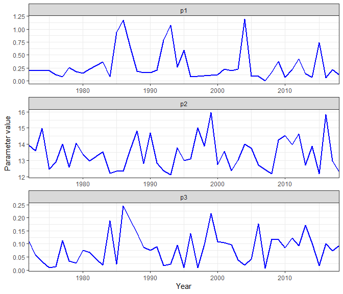

<!-- README.md is generated from README.Rmd. Please edit that file -->

# Bifrost package

Sondre Hølleland, Samuel Subbey <!-- badges: start -->
<!-- badges: end -->

*Institute of Marine Research, Norway.*

*Correspondance to: <sondre.hoelleland@hi.no>, <samuel.subbey@hi.no>*

## Capelin assessment

This R package is a wrapper for doing capelin stock assessment.


Capelin from the Barent Sea. Source: hi.no, Photographer: Jan de Lange /
Institute of Marine Research

## Plan of development

  - [x] Maturity
  - [ ] Bifrost
  - [ ] Monte Carlo Simulation

## Install package

To install the package, run the following code:

``` r
library(devtools)
install_github("holleland/bifrost")
```

The package uses **TMB** (Template model builder).

## Maturity

Here is an example to play with if you want to estimate maturity for
capelin. In the package we have included a three datasets to help you
get started with running the maturity estimation. First of all, you need
to load the data:

``` r
library(bifrost)
# -- load the data --
data(cap) # capelin abundance table
data(catch) # capelin catch data
data(maturityInitialParameters) # initial parameters for 1972-2019
head(cap)
#>   length.group     1 2 3 4 5 sum(10e9) biomass(10e3t) meanweight(g)
#> 1            1  0.00 0 0 0 0      0.00            0.0           0.0
#> 2            2  0.00 0 0 0 0      0.00            0.0           0.0
#> 3            3  2.63 0 0 0 0      2.63            1.8           0.7
#> 4            4  5.12 0 0 0 0      5.12            5.1           1.0
#> 5            5 11.89 0 0 0 0     11.89           14.3           1.2
#> 6            6 26.62 0 0 0 0     26.62           45.3           1.7
#>   meanlength(cm) year
#> 1           5.25 1972
#> 2           5.75 1972
#> 3           6.25 1972
#> 4           6.75 1972
#> 5           7.25 1972
#> 6           7.75 1972
head(catch)
#>   age year   winter05   winter03   winter02   spring01 spring05   spring04
#> 1   1 1972 0.00040000 0.00024000 0.00016000 0.00000000 0.000000 0.00000000
#> 2   2 1972 0.22621739 0.13573043 0.09048696 0.00520000 0.026000 0.02080000
#> 3   3 1972 0.16786677 0.10072006 0.06714671 0.25672112 1.283606 1.02688449
#> 4   4 1972 0.03472727 0.02083636 0.01389091 0.02366479 0.118324 0.09465918
#> 5   5 1972 0.00615000 0.00369000 0.00246000 0.00000000 0.000000 0.00000000
#> 6   1 1973 0.00000000 0.00000000 0.00000000 0.00000000 0.000000 0.00000000
#>   fill0 fill1 fill2 fill3 autumn08 autumn02
#> 1     0     0     0     0  0.00000  0.00000
#> 2     0     0     0     0  1.02296  0.25574
#> 3     0     0     0     0  7.41944  1.85486
#> 4     0     0     0     0  3.31168  0.82792
#> 5     0     0     0     0  0.25320  0.06330
#> 6     0     0     0     0  0.01000  0.00250
head(maturityInitialParameters)
#>   year  p1   p2   p3 nu unknown
#> 1 1972 0.2 15.0 0.09  6       0
#> 2 1973 0.1 13.0 0.01  6       0
#> 3 1974 0.3 14.5 0.02  4       0
#> 4 1975 0.2 12.5 0.01  5       0
#> 5 1976 0.2 13.5 0.01  7       0
#> 6 1977 0.1 16.0 0.10 10       0
```

Having the data loaded, we can set up the estimation procedure for the
year 1985:

``` r
year <- 2003
#.. Create data list: ..
data.list <- createMaturityData(cap = cap, 
                                catch = catch, min_age = 3, max_age = 4, 
                                start_year = year, end_year = year+1)
#.. Create parameter list: ..
par.list <- createMaturityParameters(maturityInitialParameters, 
                                     year = year)
#.. Estimate maturity: ..
est <- estimateMaturity(data= data.list,
                        parameters = par.list, silent=T)
#.. Print estimates.. 
est$sdrep
#> sdreport(.) result
#>       Estimate   Std. Error
#> lnp1 -1.470282 1.027456e-04
#> lnp2  2.566993 7.114205e-07
#> lnp3 -3.233201 3.466612e-04
#> lnnu 32.267387 3.793877e-04
#> Warning:
#> Hessian of fixed effects was not positive definite.
#> Maximum gradient component: 44.01566
```

You can also run all years sequentially using the following function:

``` r
result <- runMaturityYearByYear(cap = cap, catch = catch, initPar = maturityInitialParameters,
                                min_age = 3, max_age = 4, plot = FALSE)
result$plot
```



## References

Put link to papers here.

In the development of this package, we have used

  - [TMB](https://github.com/kaskr/adcomp) - the backbone of package
  - [TMBtools](https://github.com/mlysy/TMBtools) - helpful for makin an
    R package with using TMB

## Licence

This project is licensed under the MIT licence - see
[LICENSE.md](LICENSE.md) for details.


